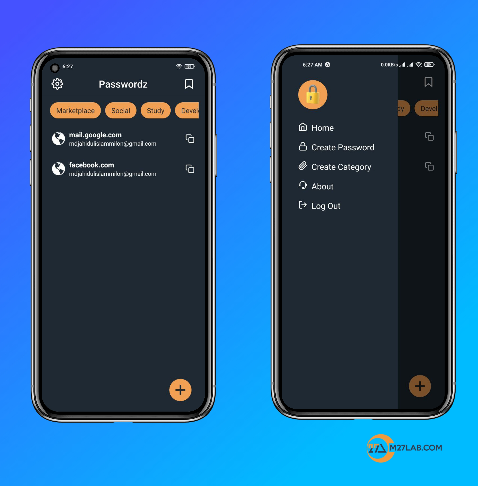

## React Native Expo Password Manager

>> All passwords/data are secure, I am using client-side encryption. no raw data is going to our server, all data are encrypted in the client and then transfer to the server.

>> Used technology

* React Native Expo
* Context Api and React Hooks
* Async Storage
* react-navigation
* Axios
* API (Node JS & Mongo DB)

>> apk file
<a href="https://drive.google.com/file/d/1JXg-B0PUI3vA9JQ1M-xR3iqZ_5cJAFVu/view?usp=drive_link" download>Click to Download</a>

>> app screenshot

